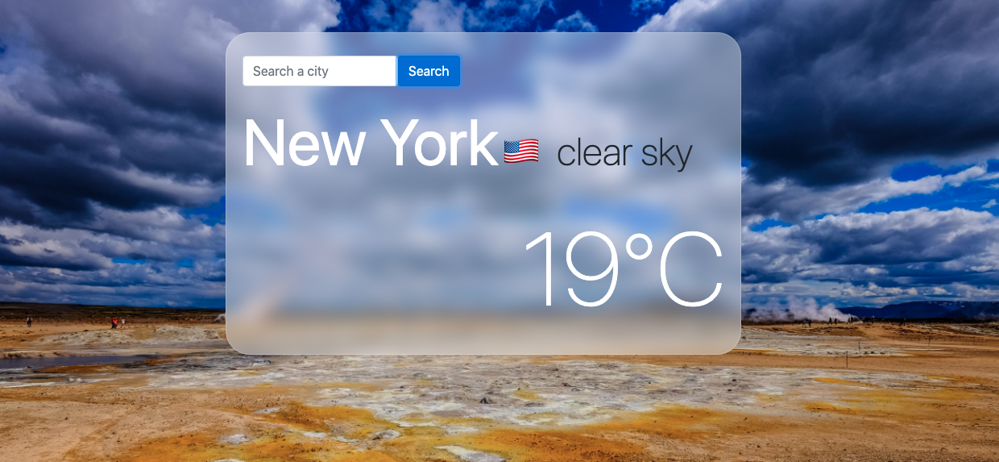

# Weather-App

## Project Description

> This project is a weather forecast web application that uses the **WEATHER API** to retrieve weather data of most cities around the world and present it to the user in response to their specific entry.

### Screenshots

##  🔧 Built with

- HTML5

- CSS3
- Javascript
- Node Package Manager (npm)
- Webpack
- OpenWeatherMap API

## 🔴 Live Demo

- [Weather App]()

## Get started
### Prerequisites
1. Node Package Mangaer(npm) should be installed on your local machine.

### Steps to follow
1. Clone the repository to your local machine using `git clone git@github.com:ahmadchata/weather-app-js.git`

1. On your local machine, navigate to the Weather-App folder using `cd weather-app-js` in your terminal

1. Run `npm install` to install all the necessary dependencies.

1. Run `npm run build`

1. Open the `index.html` file in the dist folder in your favorite browser, or copy its file path and paste it in your favorite browser.

## 🤝 Contributions
  There are two ways of contributing to this project:

1. If you see something wrong or not working, please check [the issue tracker section](https://github.com/ahmadchata/weather-app-js/issues), if that problem you met is not in already opened issues then open the issue by clicking on `new issue` button.

2. If you have a solution to that, and you are willing to work on it, follow the below steps to contribute:
    1.  Fork this repository

    1.  Clone it on your local computer by running `git clone git@github.com:ahmadchata/weather-app-js.git` __Replace *ahmadchata* with the username you use on github__
    1.  Open the cloned repository which appears as a folder on your local computer with your favorite code editor
    1.  Create a separate branch off the *master branch*,
    1.  Write your codes which fix the issue you found
    1.  Commit and push the branch you created
    1.  Raise a pull request, comparing your new created branch with our original master branch [here](https://github.com/ahmadchata/weather-app-js)

## ✒️  Authors

👤 **Ahmad Chata**

- Github: [@ahmadchata](https://github.com/ahmadchata)
- Twitter: [@ahmadchata](https://twitter.com/ahmadchata)
- Linkedin: [Ahmad Chata](https://linkedin.com/in/ahmadchata)

## Show your support

Give a ⭐️ if you like this project!

## Acknowledgements

- This project was originally taken from [the Odin project](https://www.theodinproject.com/courses/javascript/lessons/weather-app).
